```{r setwd, include=FALSE}

library(kableExtra)
library(cowplot)
library(readr)
library(dplyr)

```

\newpage
\tableofcontents 
\newpage
\listoffigures
\newpage


# Introduction

This report describes the initial findings of the exploratory data analysis conducted for building the foundation of the anomaly detection algorithm to be developed. It is divided in the following sections:

* **Flight data**: brief description of the flight data collection used;
* **Preliminary data visualization**: introductory charts for flight data familiarization;
* **Benchmark**: presentation of the results obtained with PyMKAD;
* **Landing drill down**: discussion focused on the landing phase;
* **Anomalies**: introductory discussion of the potential anomalies found in the data (quantitatively and qualitatively);
* **Clustering**: initial findings of the application of clustering algorithms.

This report currently focuses on the Landing phase, for which the MKAD algorithm detected anomalies.

The underlying code for analyzing the flight data and plotting charts can be found in *eda.py* and *eda_clustering.py*.

# Flight data

For this preliminary analysis, the flight data used was the one publicly available with the Multiple Kernel Anomaly Detection (MKAD) algorithm (https://ti.arc.nasa.gov/opensource/projects/mkad/). It is composed by 112 flights, available as *csv* files. Each flight contains observations for the following parameters:

* Time;
* Altitude;
* AirSpeed;
* Landing_Gear;
* Thrust_Rev;
* Flaps;
* Param1_1;
* Param1_2;
* Param1_3;
* Param1_4;
* Param2;
* Param3_1;
* Param3_2;
* Param3_3;
* Param3_4;
* Param4.

## Flights heterogeneity

The flights available clearly encompass operations for different routes, given the diverse flight times and distances from touchdown presented on the charts in the *Preliminary data visualization* chapter. This raises a few questions:

* Should anomaly detection be restricted to a set of flights that are supposed to be similar? In a sense that the algorithm must beware that those flights refer to the same operation (landing at a given airport, e.g.)
* What are the disadvantages of restricting the sets of flights? One could lose track of a rare but potentially hazardous anomaly that happened in two different operations but with the same root cause. In order to avoid these scenarios, the methodology could contemplate the anomalies also being clustered amongst themselves.

# Preliminary data visualization


```{r altitude_time, echo=FALSE , fig.cap="Altitude vs flight time",out.width = "100%", fig.align="center",fig.pos = 'H'}

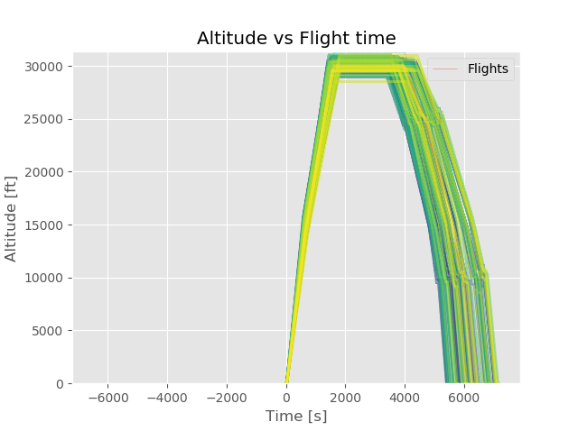

```

```{r airspeed_time.png, echo=FALSE , fig.cap="Airspeed vs flight time",out.width = "100%", fig.align="center",fig.pos = 'H'}

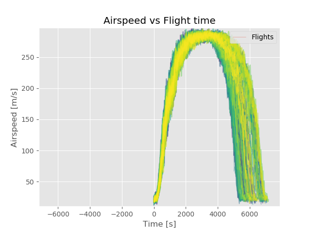

```

Since the landing phase is the one currently being considered, it is more adequate to visualize the data in terms of the distance from touchdown.

```{r altitude_distance, echo=FALSE , fig.cap="Altitude vs distance from touchdown",out.width = "100%", fig.align="center",fig.pos = 'H'}

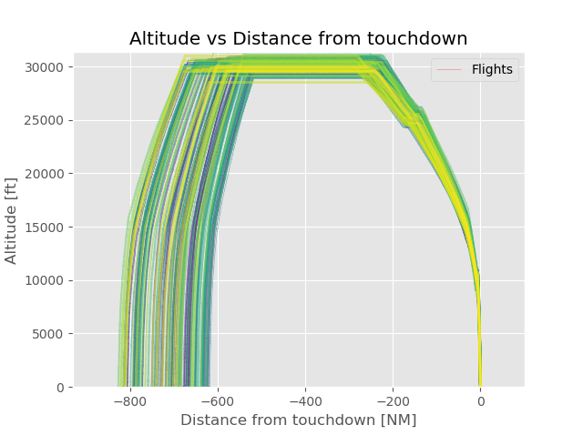

```

```{r airspeed_distance, echo=FALSE , fig.cap="Airspeed vs distance from touchdown",out.width = "100%", fig.align="center",fig.pos = 'H'}

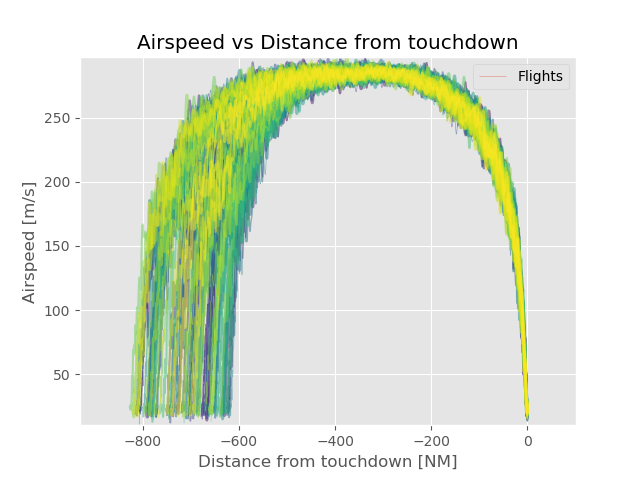

```

# Landing drill down

As mentioned, this report will currently focus on the Landing phase, for which the MKAD algorithm detected anomalies. The charts are then redrawn to emphasize the landing window.

```{r landing_altitude_distance, echo=FALSE , fig.cap="Altitude vs distance from touchdown (landing)",out.width = "100%", fig.align="center",fig.pos = 'H'}

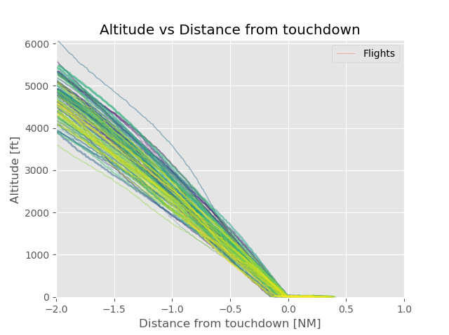

```

```{r landing_aispeed_distance, echo=FALSE , fig.cap="Airspeed vs distance from touchdown (landing)",out.width = "100%", fig.align="center",fig.pos = 'H'}

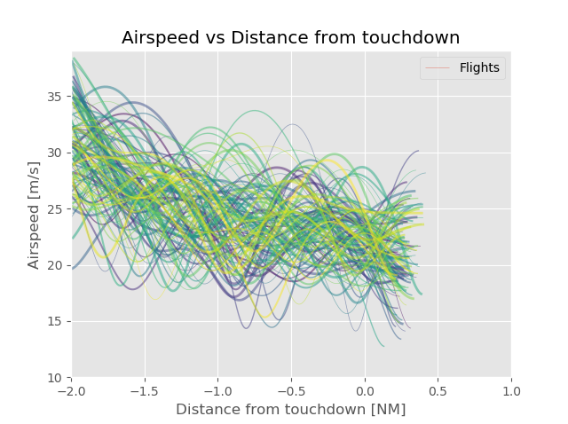

```

# Anomalies

```{r landing_altitude_distance_bounded, echo=FALSE , fig.cap="Altitude vs distance from touchdown (landing), bounded",out.width = "100%", fig.align="center",fig.pos = 'H'}

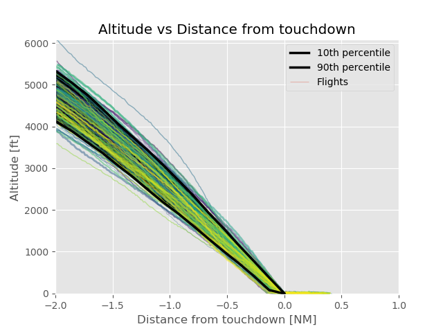

```

```{r landing_aispeed_distance_bounded, echo=FALSE , fig.cap="Airspeed vs distance from touchdown (landing), bounded",out.width = "100%", fig.align="center",fig.pos = 'H'}

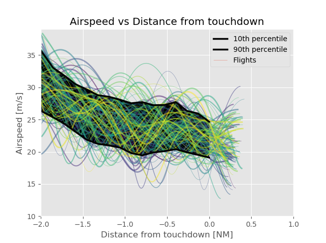

```

Include discussions.

# Benchmark

Include anomalies detected by MKAD.

# Clustering

Initially, DBSCAN (https://scikit-learn.org/stable/modules/generated/sklearn.cluster.DBSCAN.html) is being used as the clustering algorithm. The Python code used for clustering can be found in *eda_clustering.py*. It aims to be conceptually similar to ClusterAD-Flight, defined by @li_anomaly_2013.

The flights marked as "anomalies"" (isolated clusters) are listed on the table below.

``` {r echo=FALSE}
dt <- read.table("local/anomalous_clusters.csv", header=TRUE, sep=',')
dt %>%
  kbl() %>%
  kable_material(c("striped", "hover"))
  
```

In the figures below, the red lines mark the "anomalous" flights. For now, only the Altitude and Airspeed charts are presented, even though the other parameters might be the ones indicating an anomalous behavior.

```{r landing_anomalies_altitude, echo=FALSE , fig.cap="Altitude vs distance from touchdown (landing)",out.width = "100%", fig.align="center",fig.pos = 'H'}

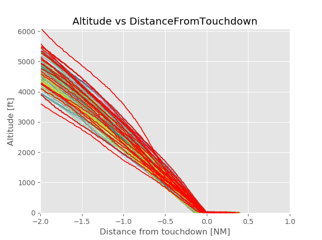

```

```{r landing_anomalies_airspeed, echo=FALSE , fig.cap="Airspeed vs distance from touchdown (landing)",out.width = "100%", fig.align="center",fig.pos = 'H'}

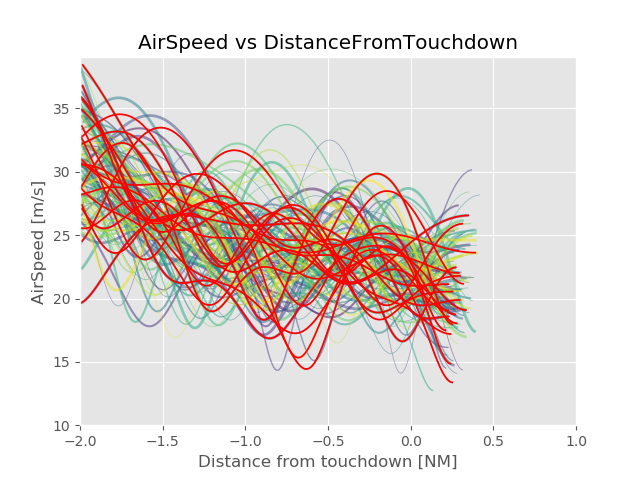

```

```{r landing_anomalies_altitude_bounded, echo=FALSE , fig.cap="Altitude vs distance from touchdown (landing), bounded",out.width = "100%", fig.align="center",fig.pos = 'H'}

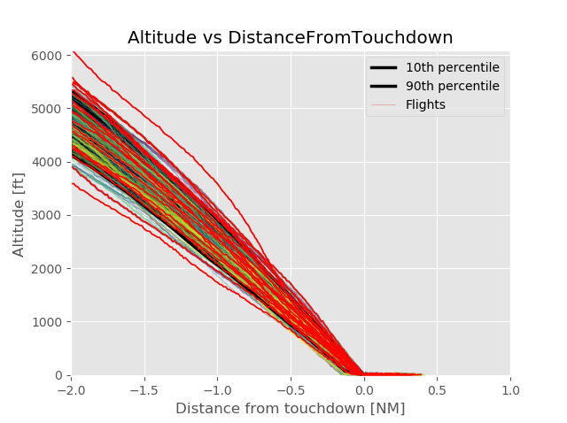

```

```{r landing_anomalies_airspeed_bounded, echo=FALSE , fig.cap="Airspeed vs distance from touchdown (landing), bounded",out.width = "100%", fig.align="center",fig.pos = 'H'}

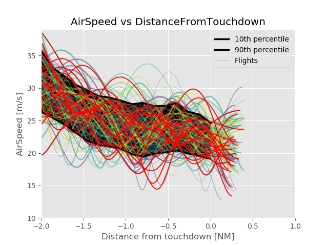

```

Discuss clustering methodology and results. Improve visualization without color repetition.


\newpage
